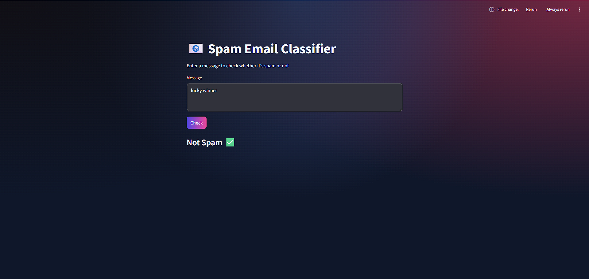

📧 Spam Email Classifier

A Machine Learning-based Spam Email Classifier that identifies whether a message is Spam 🚫 or Not Spam ✅ using Natural Language Processing (NLP) techniques.

📸 Project Preview

  

📌 Overview
The Spam Email Classifier is an NLP-based machine learning project designed to classify messages as spam or legitimate messages.
The system uses TF-IDF Vectorization for text feature extraction and the Naive Bayes Algorithm for classification. The project also includes a simple and interactive user interface built with Streamlit, allowing users to enter custom messages and receive instant predictions.

This project demonstrates the complete workflow of a machine learning application, including:
Data preprocessing
Text vectorization
Model training
Prediction generation
Interactive web interface development

🧠 Features
📧 Spam message detection
🔍 NLP-based text preprocessing
⚡ Fast and lightweight prediction system
🎯 TF-IDF feature extraction
🤖 Naive Bayes classification model
🖥️ Interactive Streamlit user interface
✅ Real-time prediction results

🛠️ Technologies Used
Python
Pandas
NumPy
Scikit-learn
Streamlit
Natural Language Processing (NLP)

📂 Project Structure

spam-classifier/
|── assets/
|   └── email-classifier.png
│── data/
│    └── spam.csv
│
│── assets/
│    └── spam-view.png
│
│── src/
│    ├── preprocess.py
│    ├── model.py
│
│── app.py
│── requirements.txt

⚙️ Working Process

1. Data Collection
The dataset contains labeled messages categorized as:
Spam → unwanted promotional or fraudulent messages
Ham → legitimate messages

2. Data Preprocessing
The preprocessing stage includes:
Removing missing values
Converting labels into numerical values
Preparing the text data for vectorization

3. Feature Extraction
TF-IDF Vectorization converts text messages into numerical vectors so that machine learning algorithms can process the data effectively.

4. Model Training
The Naive Bayes classification algorithm is trained on the processed dataset to identify spam patterns in messages.

5. Prediction
Users can enter any custom message through the Streamlit interface, and the system predicts whether the message is spam or not spam in real time.

🌐 User Interface
The application provides a clean and user-friendly interface where users can:

Enter a message
Click the prediction button
View instant classification results

🚀 Future Enhancements
Deep Learning-based spam detection
BERT or LSTM implementation
Email API integration
Model accuracy visualization
Cloud deployment using AWS or GCP
Advanced text preprocessing techniques

💡 Learning Outcomes
This project helped in understanding:
Fundamentals of Natural Language Processing
Text vectorization using TF-IDF
Machine Learning classification algorithms
Building interactive ML applications
End-to-end machine learning workflows

⭐ Conclusion
The Spam Email Classifier is a beginner-friendly yet practical machine learning project that demonstrates how NLP and classification algorithms can be used to solve real-world problems efficiently.

📬 Contact
For suggestions, improvements, or collaboration opportunities, feel free to connect.

⭐ If you like this project, consider giving it a star on GitHub!